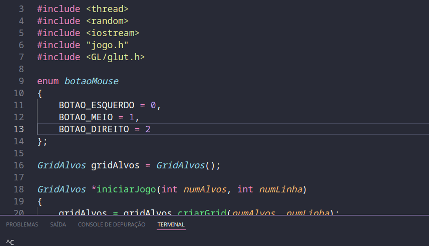

# Aimlab

**Um cenário de treinamento de mira e tiro com blocos aparecendo e sumindo em um cenário 3D de forma aleatória.**

**Jogo funcionando:**

**Como executar o jogo** 

baixar o repositório e digitar o seguinte comando no terminal:

g++ main.cpp jogo.cpp ambiente.cpp Alvo.cpp GridAlvos.cpp Ponto.cpp camera.cpp iluminacao.cpp -o main -lm -lGL -lGLU -g -lglut && ./main

